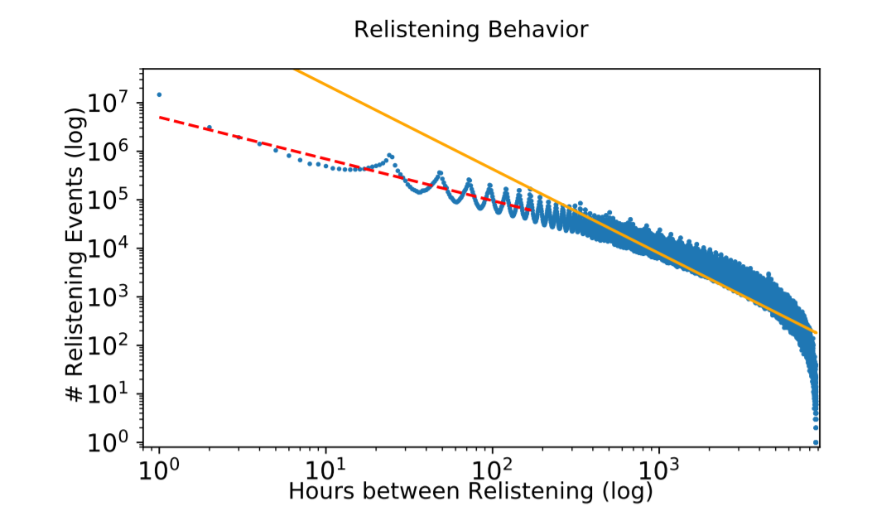

# Predicting Music Relistening Behavior Using the ACT-R Framework

This repository contains the code for the paper: `Predicting Music Relistening Behavior Using the ACT-R Framework`. ([Link to paper(https://dl.acm.org/doi/10.1145/3460231.3478846) or [Link to preprint]( https://arxiv.org/abs/2108.02138))

The paper deals with modeling relistening behavior using a cogntive framework of human memory. 

TLDR: we demonstrate the utility of modeling the relistening behavior using the ACT-R framework.



## Structure

The repo consists of 5 stages:
- First everything regarding the dataset itself including [preparation](1_0_dataset_prep.ipynb), [user selection](1_1_user_selection.ipynb), and [statistics](1_2_dataset_stats.ipynb)
- Analyzing the [relistening behavior](2_relistening_behavior.ipynb)
- The [evaluation protocol](3_evaluation_protocol.ipynb)
- The [performance comparison](4_performance_comparison.ipynb)
- Considering combinations including [parameter estimation](5_1_hybrid_parameter_estimation.ipynb), [evaluation](5_2_hybrid_evaluation_protocol.ipynb), and reporting the [performance](5_3_hybrid_performance_comparison.ipynb)

In addition we provide the code for the [data splitting](data_splitter.ipynb) and the [algorithms](algorithms.ipynb).

## Cite

Bibtex for Paper:

```
@inproceedings{reiter2021predicting,
  title={Predicting Music Relistening Behavior Using the ACT-R Framework},
  author={Reiter-Haas, Markus and Parada-Cabaleiro, Emilia and Schedl, Markus and Motamedi, Elham and Tkalcic, Marko and Lex, Elisabeth},
  booktitle={Fifteenth ACM Conference on Recommender Systems},
  pages={702--707},
  year={2021}
}
```
